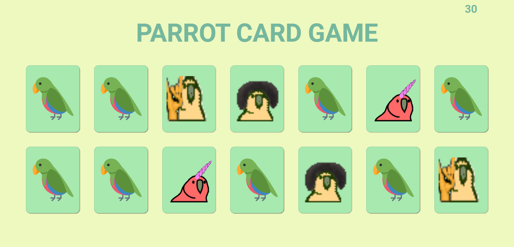

# <p align = "center"> Projeto #04 - Parrot Card Game </p>

<p align = "center">

</br>
<br/>

<p align = "center"> </p>

</br>

## ✏️ Descrição

<p align="justify" >Meu segundo projeto com JavaScript, a implementação do jogo Parrot Card Game, um jogo da memória temático com aleatoridade, efeitos e transição, responsividade e papagaios dançantes!</p>

</br>

## <p align = "left"> :white_circle: Tecnologias</p>

- 
- 
- 

</br>

# Layout

[Parrot Card Game](https://www.figma.com/file/EBizkrjH73Ku9fmib49Hlm/Parrot-Card-Game)

</br>

# 🏁 Vamos lá

Primeiro clone o repositório remoto para o seu computador e abra a pasta criada

```bash
git clone https://github.com/driven-education-cfigueiroa/Projeto_04_parrotsCardGame.git && cd Projeto_04_parrotsCardGame
```

E depois, abra o arquivo index.html no seu navegador padrão.
